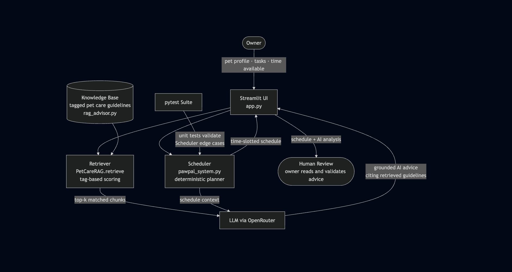

# PawPal+

## The Original Project: PawPal

PawPal was a Streamlit web app that helped busy pet owners build a daily care schedule for their pets. It let you enter your pet's tasks (walks, feeding, medications, grooming), assign priorities and durations, and automatically arranged them into a time-blocked plan that fit within however many minutes you had available that day. Its explanations were purely mechanical — it told you what got scheduled and what got skipped, but had no knowledge of what was actually good or appropriate for your specific pet.

---

## PawPal+ — What It Does Now and Why It Matters

PawPal+ adds a RAG (Retrieval-Augmented Generation) layer on top of the original scheduler. After your daily schedule is built, the app consults a curated library of real pet care guidelines — covering species, breeds, age groups, and health conditions — and retrieves only the ones relevant to your specific pet. Those guidelines are then handed to an AI model, which reads your schedule alongside them and produces expert, grounded analysis: not just what was scheduled, but whether it is actually appropriate for your pet and where it could be improved.

This matters because a generic scheduler treats a 1-year-old Beagle and a 10-year-old arthritic cat identically. PawPal+ does not. The advice you see is shaped by who your pet actually is.

---

## Architecture Overview



**How data flows through the system:**

1. The owner enters their pet's profile (species, breed, age, special needs), a list of tasks, and how many minutes they have available
2. The **Scheduler** (unchanged from PawPal) sorts tasks by priority and packs them into time slots — this part is fully deterministic
3. The **Retriever** scores every chunk in the knowledge base by how many of its tags match the pet's profile and the scheduled task categories, then returns the top matches
4. The **LLM** (via OpenRouter) receives the generated schedule plus the retrieved guidelines and produces advice that cites specific guidelines — it is not allowed to invent facts outside of what was retrieved
5. The owner reads the AI analysis and decides whether to act on any suggestions — human review is the final check on AI output quality
6. The **pytest suite** covers the deterministic Scheduler logic; non-deterministic LLM output is validated by the owner reading it

---

## Setup Instructions

**1. Clone the repository and enter the project folder**

```bash
git clone <your-repo-url>
cd ai110-module2show-pawpal-starter
```

**2. Create and activate a virtual environment**

```bash
python3 -m venv .venv
source .venv/bin/activate      # Mac / Linux
.venv\Scripts\activate         # Windows
```

**3. Install dependencies**

```bash
pip install -r requirements.txt
```

**4. Add your OpenRouter API key**

Create a `.env` file in the project root (it is already in `.gitignore` so it will not be committed):

```
OPENROUTER_API_KEY=your_key_here
```

Get a free key at [openrouter.ai](https://openrouter.ai).

**5. Run the app**

```bash
streamlit run app.py
```

**6. Using the app**

- Fill in your name and how many minutes you have today
- Add one or more pets (species, breed, age, any special needs)
- Add the tasks you want to complete (category, duration, priority)
- In the sidebar, confirm your API key is loaded and pick a model
- Click **Generate schedule** — your plan appears along with an AI analysis in the expandable panel at the bottom

**7. Run the tests**

```bash
pytest
```

---

## Design Decisions

### Why RAG instead of just prompting an LLM directly?

Sending only the schedule to an LLM and asking for advice would produce generic answers drawn from the model's training data — accurate on average, but not grounded in anything specific. RAG flips this: the knowledge base is retrieved first based on the actual pet's profile, and the LLM is constrained to cite only what was retrieved. This means a Beagle gets Beagle-specific advice, a diabetic cat gets diabetes-specific advice, and the model cannot hallucinate guidelines that were never part of the library.

### Why tag-based retrieval instead of embeddings?

Embedding-based retrieval (e.g. with a vector database) is more powerful for open-ended queries but adds significant infrastructure — you need an embedding model, a vector store, and an indexing step. For a knowledge base of this size and a well-defined input schema (species, breed, age, task category), tag scoring is faster, fully transparent, and requires no external services. Every retrieval decision can be inspected directly in the code.

### Why OpenRouter instead of a single provider?

OpenRouter gives access to dozens of models — including several free tiers — through one API key and one standardised interface. This means you can switch between Llama, Gemma, Mistral, GPT-4o, or any other model by changing a single dropdown, without touching any code. It also avoids locking the project to a paid provider for a demo or educational context.

### Trade-offs

| Decision                                | Benefit                                                  | Trade-off                                               |
| --------------------------------------- | -------------------------------------------------------- | ------------------------------------------------------- |
| Tag-based retrieval                     | Simple, transparent, no extra services                   | Less flexible than semantic search for unusual queries  |
| Knowledge base is hardcoded             | No database required, easy to inspect and extend         | Adding new guidelines requires editing the Python file  |
| LLM call happens on schedule generation | Advice is always fresh and reflects the current schedule | Adds a network round-trip; free model tiers may be slow |
| Fallback to mechanical reasoning        | App still works without an API key                       | Fallback output is much less useful                     |
